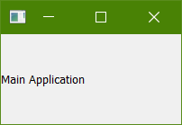
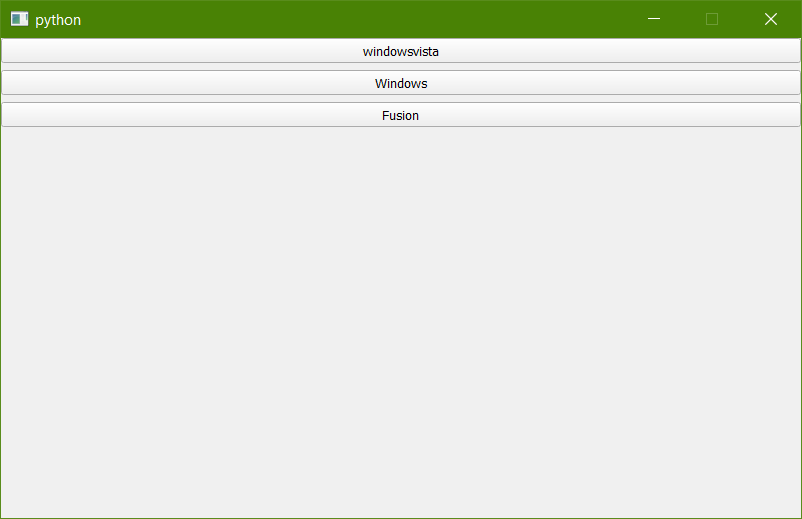
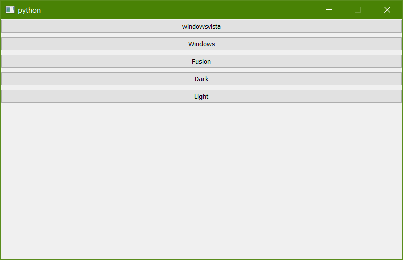
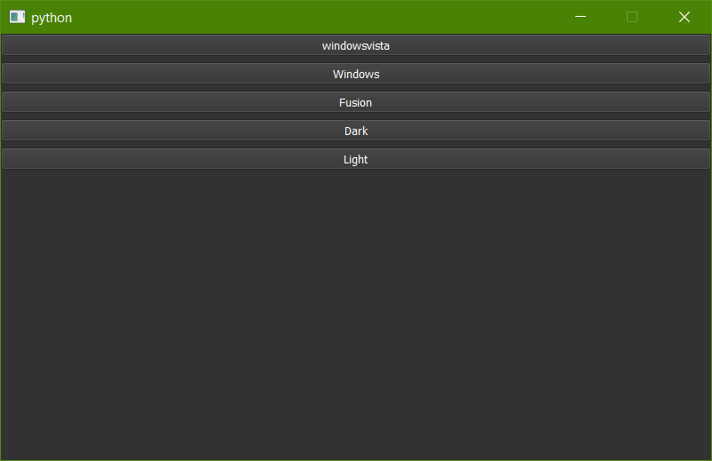

# PySide2-PyQt5-Useful-UI-Components

This repository contains User Interface(UI) Components and Building blocks useful or a bigger project.

## 1) logo_screen
Example code to show how to add a logo screen to your Qt Application

 

## 2) Custom Theme, Custom Color Palette, Button Creation in Loops
Example codes to switch main Theme, Switch between color themes and how to generate button in a loop.

Toggle Between available themes. 

Toggle Between available themes.And change the color palette of the active theme.

## 3) Display_image_QComboBox
Example code to,
1. Open existing Image as QImage convert it to Qpixmap and Show it the User Interface.
2. Generate random Image using Numpy array, Convert Numpy array to QImage, convert it to Qpixmap and Show it the User Interface.
3. Select between two image options using QComoBox

